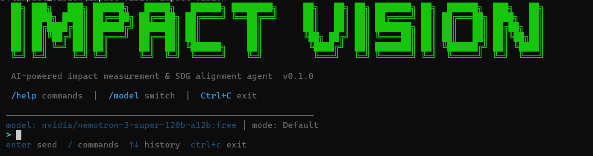
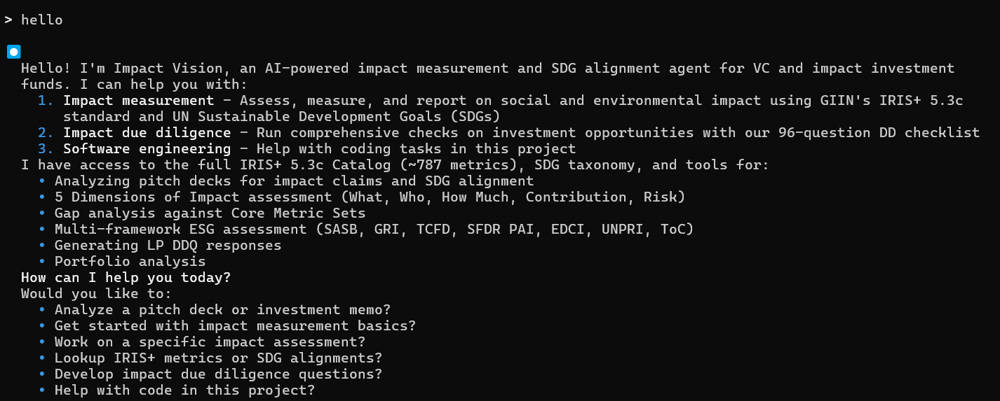
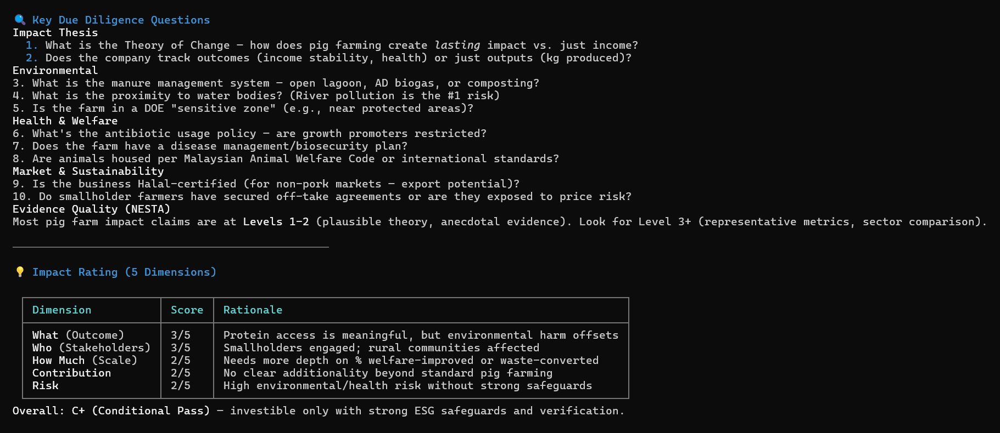
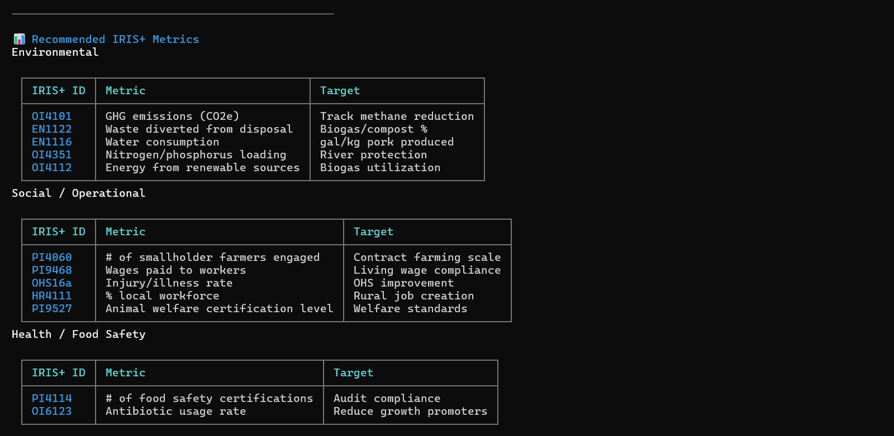
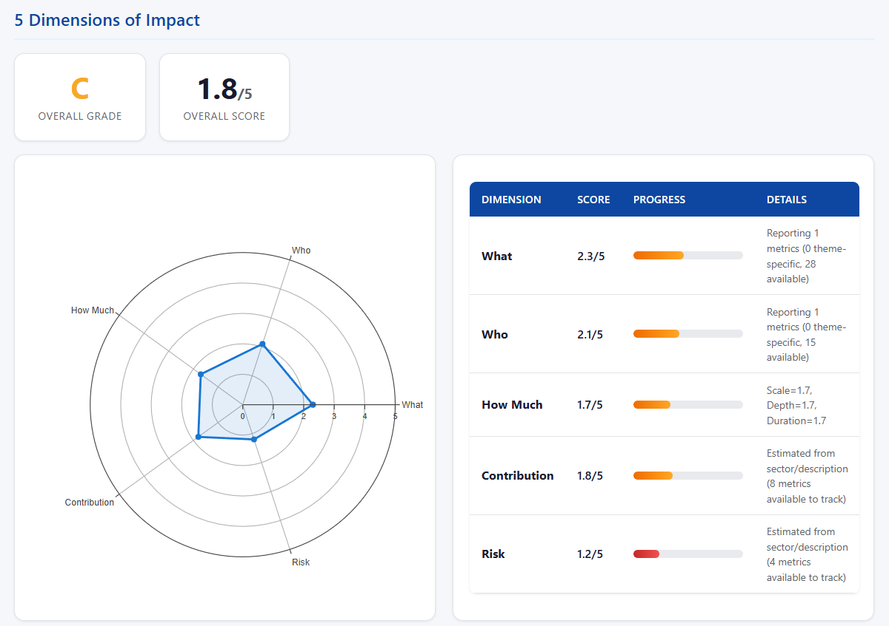
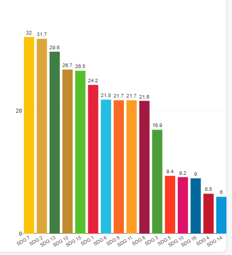
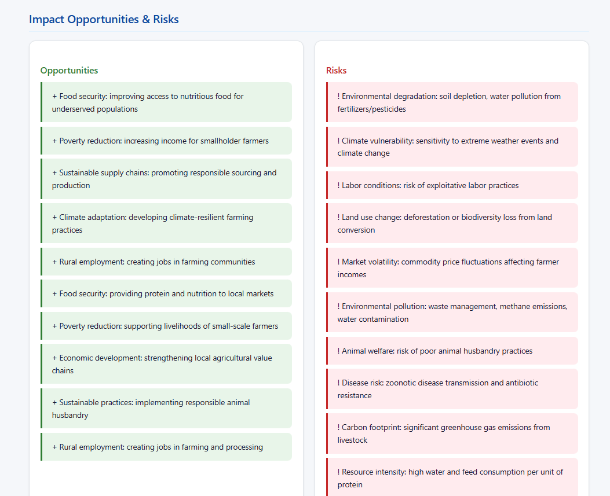

# Impact Vision

> **v0.13.0 · 2026-04-21** — DD Questionnaire Helper (HTML + Word), Web Console, report polish, green CI. See [CHANGELOG.md](CHANGELOG.md).

Open-source AI-powered impact measurement and SDG alignment agent for VC and impact investment funds.

Built on [OpenHarness](https://github.com/HKUDS/OpenHarness), Impact Vision ships a conversational AI agent, a **CLI**, a **REST API** (26+ endpoints), an **MCP server** (26 tools), a **Streamlit dashboard** and a **single-file Web Console** — all backed by the same engine with deep expertise in GIIN's IRIS+ framework, UN SDGs, the 5 Dimensions of Impact, and 10 ESG / regulatory frameworks (ISSB, ESRS, SFDR, TCFD, SASB, GRI, PCAF, SBTi, EU Taxonomy, TNFD, CDP).



## Screenshots

<table>
<tr>
<td width="50%"><br><em>AI agent with full impact measurement toolkit</em></td>
<td width="50%"><br><em>Due diligence questions + 5-Dimension scoring</em></td>
</tr>
<tr>
<td><br><em>Recommended IRIS+ metrics by category</em></td>
<td><br><em>HTML report: 5-Dimension radar chart with scores</em></td>
</tr>
<tr>
<td><br><em>SDG alignment scoring (17 goals, official UN colors)</em></td>
<td><br><em>Sector-specific opportunities & risks analysis</em></td>
</tr>
</table>

> **Try it yourself:** See a [sample HTML report](examples/sample_impact_report.html) generated for a pig farm in Malaysia.

## What is Impact Investing?

Impact investing means investing with the intention to generate **positive, measurable social and environmental impact** alongside a financial return. Unlike traditional investing (financial return only) or philanthropy (social good only), impact investing seeks both.

Key concepts Impact Vision helps with:

| Concept | What it means |
|---------|---------------|
| **IRIS+** | The "GAAP for impact" -- ~787 standardized metrics for measuring social/environmental outcomes (maintained by GIIN) |
| **SDGs** | 17 UN Sustainable Development Goals (e.g., No Poverty, Clean Energy, Climate Action) with 169 targets |
| **5 Dimensions** | The standard framework for assessing impact quality: What outcome? Who benefits? How much? Would it happen anyway? What could go wrong? |
| **Impact DD** | Due diligence focused on whether an investment will actually generate the claimed impact |
| **ESG** | Environmental, Social, Governance -- risk management frameworks (SASB, GRI, TCFD, SFDR, EDCI, UNPRI, ISSB, ESRS) |
| **NESTA Evidence** | 5 levels rating how strong the evidence is: Level 1 (narrative) to Level 5 (rigorous RCT) |

## Core Use Case

**Upload a pitch deck or investment memo** and Impact Vision will:

1. Extract and classify impact claims (outcome / output / activity / intent / risk)
2. Map claims to relevant **IRIS+ metrics** from the 787-metric catalog
3. Detect **SDG goal/target alignment** from the content
4. Run an **impact DD checklist** (122 questions across 34 categories from GIIN, PCV, Seraf, IMP, AFME + sector-specific for 15 sectors)
5. Assess **evidence strength** using NESTA Standards of Evidence (levels 1-5)
6. Auto-extract a **Company model** for immediate use with downstream assessment tools
7. Compare against **sector benchmarks** from GIIN survey data
8. Suggest the most important **follow-up questions** for the investment team
9. Generate reports in **HTML** (with Plotly charts), **XLSX**, CSV, JSON, or text

## For Fund Managers — 60-second workflow (v0.13.0)

```python
from openharness.impact.sdk import ImpactVision
from openharness.impact.models import Company

iv = ImpactVision()                          # regex extractor + heuristic verifier by default

# 1) Assess a deal from a pitch deck / impact report
asst = iv.assess_company_text(
    "Acme Solar",
    text=pitch_deck_text,
    sector="energy",
    country="KE",
    impact_themes=["climate"],
)

# 2) Run it through your fund's IC gate (uses data/fund_thesis.yaml)
sc = iv.evaluate_deal_against_thesis(
    asst,
    dd_coverage_pct=iv.run_dd_coverage(pitch_deck_text).coverage_pct,
    greenwashing_score=iv.screen_greenwashing(asst.company).overall_score,
)
print(sc.overall_status)                     # "pass" / "warn" / "fail"

# 3) IC memo — Markdown, HTML (print-ready), Word, PowerPoint
iv.render_ic_memo(asst, scorecard=sc, output_format="html", path="ic/acme.html")
iv.render_ic_memo(asst, scorecard=sc, output_format="docx", path="ic/acme.docx")

# 4) DD Questionnaire Helper — risk-first HTML the analyst actually works from
iv.render_dd_questionnaire_html(
    pitch_deck_text, company_name="Acme Solar",
    document_label="Pitch deck v3", path="dd/acme.html",
)

# 5) Same questionnaire as an editable Word doc with founder-response slots
iv.render_dd_questionnaire_docx(
    pitch_deck_text, company_name="Acme Solar",
    document_label="Pitch deck v3", path="dd/acme.docx",
)

# 6) Portfolio-level roll-up weighted by capital deployed
roll = iv.rollup([(asst_a, 5.0, 12.0), (asst_b, 8.0, 20.0)])   # (assessment, EUR_m, ownership_%)

# 7) Next 12 months of LP report deliverables
cal = iv.build_lp_calendar(horizon_months=12)
```

Prefer a browser? `impact-vision serve-web` launches the [Web Console](#web-console-power-user-ui) + REST API in one process at `http://127.0.0.1:8787` and puts all 26 tools one click away.

**What's new in v0.13.0 — analyst-day polish.**
- **DD Questionnaire Helper** — the DD HTML is rebuilt around the work a GP still has to do: key risks, priority-sorted questionnaire (by severity × natural DD sequence), and a consolidated evidence / document-gap checklist. Legacy coverage table moved to an appendix.
- **Word (.docx) export** — `ImpactVision.render_dd_questionnaire_docx()` hands you an editable `.docx` with empty "Founder response" slots, ready to email.
- **Impact-report rationale fix** — the *"How this grade was calculated"* panel now uses fixed widths, word-wrap and a responsive scroll fallback so every driver fits at 1080 px and on tablets.
- **Web Console (v1)** — `openharness.web` is a single-file SPA on top of the FastAPI gateway; lists all 26 tools, renders forms, `POST`s to `/api/v1/*`.
- **CI green** — ruff clean on `src/`, the MCP test no longer depends on removed `FastMCP(version=…)` kwargs, and GitHub Actions is green end-to-end.

**Regulatory coverage shipped in v0.9.0** — financed emissions (PCAF), net-zero alignment (SBTi), EU Taxonomy alignment %, nature-related disclosures (TNFD v1), CDP intake. **Multi-tenant + RBAC, plug-in entry points, and hash-chained LP report feeds** shipped in v0.11.0. See the [Roadmap section](#roadmap-for-impact-investors--fund-managers) for what is planned next.

## Quick Start (from scratch)

### 1. Prerequisites

You need **Python 3.11+** and **Git**. Check if they're installed:

```bash
python --version    # should show 3.11 or higher
git --version       # any recent version
```

If not installed: [Python](https://www.python.org/downloads/) | [Git](https://git-scm.com/downloads)

### 2. Clone and install

```bash
git clone https://github.com/joejoe168168/impact-vision.git
cd impact-vision
```

Create a virtual environment (recommended):

```bash
python -m venv .venv

# Activate it:
# Windows PowerShell:  .venv\Scripts\Activate.ps1
# Windows CMD:         .venv\Scripts\activate.bat
# Mac/Linux:           source .venv/bin/activate
```

Install the package:

```bash
pip install -e ".[dev]"
```

After this, you'll have two commands available: `impact-vision` and `iv` (shorthand).

> **`'impact-vision' is not recognized`?** Run the auto-fix script:
>
> ```bash
> # Windows PowerShell
> powershell -ExecutionPolicy Bypass -File scripts\add-to-path.ps1
>
> # Windows CMD
> scripts\add-to-path.bat
>
> # Mac/Linux
> bash scripts/add-to-path.sh
> ```
>
> **Important:** After running the script, you must **close and reopen your terminal** (CMD/PowerShell/Terminal) for the PATH change to take effect. Then try `impact-vision --help`.
>
> **Alternative:** Use `python -m openharness` instead (works without PATH changes):
>
> ```bash
> python -m openharness --help
> python -m openharness catalog stats
> python -m openharness dd list
> ```

### 3. Set up an LLM provider

The AI agent needs a language model. We recommend **OpenRouter** for beginners -- it's free to start and gives you access to many models.

#### Option A: OpenRouter (recommended -- free models available)

**Step 1.** Create an OpenRouter account:

1. Go to [openrouter.ai](https://openrouter.ai/) and click **Sign Up** (Google or GitHub login works)
2. Go to [openrouter.ai/keys](https://openrouter.ai/keys) and click **Create Key**
3. Copy the key (starts with `sk-or-...`)

**Step 2.** Run the interactive setup wizard:

```bash
impact-vision setup
```

The wizard will guide you through these prompts:

```
? Choose a provider workflow:
  Anthropic-Compatible API  Claude / Kimi / GLM / MiniMax
> OpenAI-Compatible API  OpenAI / OpenRouter          <-- select this
  ...
```

```
? Choose an OpenAI-compatible provider:
  OpenAI official
> OpenRouter                                          <-- select this
```

```
? Base URL: https://openrouter.ai/api/v1              <-- press Enter (default)
? Default model: nvidia/nemotron-3-super-120b-a12b:free  <-- type a model name
```

```
? Enter API key for OpenRouter: sk-or-your-key-here    <-- paste your key
```

```
? Model: nvidia/nemotron-3-super-120b-a12b:free        <-- press Enter to confirm
Setup complete:
- profile: openrouter
- provider: openai
- auth_source: openai_api_key
- model: nvidia/nemotron-3-super-120b-a12b:free
```

Done! You can now start the agent (Step 4).

> **Free models:** Browse all free models at [openrouter.ai/models?q=free](https://openrouter.ai/models?q=free). Some examples:
>
> | Model | Notes |
> |-------|-------|
> | `nvidia/nemotron-3-super-120b-a12b:free` | Strong reasoning, good for impact analysis |
> | `google/gemini-2.5-flash:free` | Fast, good for quick tasks |
> | `meta-llama/llama-4-maverick:free` | Open-source, balanced performance |
>
> You can change your model or update your API key later by running `impact-vision setup` again.

#### Option B: Anthropic (Claude Sonnet) -- best quality for impact analysis

1. Go to [console.anthropic.com](https://console.anthropic.com/), create an account
2. Go to **API Keys** and create a key
3. Run the wizard and choose **Anthropic-Compatible API** > **Claude official**:

```bash
impact-vision setup
```

4. Paste your API key when prompted (Claude Sonnet is the default model)

#### Option C: OpenAI (GPT-5)

1. Go to [platform.openai.com/api-keys](https://platform.openai.com/api-keys), create a key
2. Run the wizard and choose **OpenAI-Compatible API** > **OpenAI official**:

```bash
impact-vision setup
```

3. Paste your API key when prompted

#### Option D: Local Ollama (free, runs on your machine, no internet needed)

1. Install Ollama from [ollama.com](https://ollama.com/)
2. Pull a model: `ollama pull llama3.2`
3. Run setup:

```bash
impact-vision ollama-setup --model llama3.2
```

No API key needed -- everything runs locally on your GPU/CPU.

| Provider | Best for | Cost |
|----------|----------|------|
| [OpenRouter](https://openrouter.ai/models?q=free) | Trying multiple models, free tier | Free + pay-per-use |
| Anthropic (Claude Sonnet) | Best impact analysis quality | Pay-per-use |
| OpenAI (GPT-5) | General purpose | Pay-per-use |
| Ollama (local) | Privacy, offline use | Free (your hardware) |

> **Model quality note:** Impact analysis requires models that support **tool calling** (function calling). Free models vary in quality -- some may not follow the impact expert persona or use the analysis tools correctly. For best results:
> - **Recommended:** Claude Sonnet, GPT-5, or `google/gemini-2.5-flash` (via OpenRouter)
> - **Good free options:** `google/gemini-2.5-flash:free`, `meta-llama/llama-4-maverick:free`
> - **May struggle:** Very small models or models without tool-calling support

### 4. Start the AI agent

```bash
impact-vision
```

Try asking:
- "Analyze this pitch deck" (provide a path to a PDF)
- "What SDGs does a solar energy company align with?"
- "Run a 5-dimension assessment for a fintech serving 50,000 clients"

### 5. Try the CLI tools (no API key needed)

These commands work without any LLM setup:

```bash
# See all available commands
impact-vision --help

# Browse IRIS+ metrics (all 787 metrics included out of the box)
impact-vision catalog stats
impact-vision catalog search "climate"
impact-vision catalog search "gender"

# List ESG/sustainability frameworks
impact-vision framework list

# Quick multi-framework scan of a company description
impact-vision framework scan "Solar energy company providing clean power to 50,000 rural households"

# Cross-reference a metric across all frameworks
impact-vision framework xref OI4112

# Browse the Due Diligence checklist (122 questions across 34 categories)
impact-vision dd list
impact-vision dd categories

# Analyze text against the DD checklist
impact-vision dd analyze "We serve 45,000 clients across 3 countries. Our NPS score is 72."
```

### 6. Update the IRIS+ Catalog (optional)

All 787 IRIS+ 5.3c metrics are already bundled and work out of the box. If GIIN releases a newer version of the catalog:

1. Download the new Excel file from [GIIN IRIS+](https://iris.thegiin.org/) (free registration)
2. Place it in `data/raw/`
3. Run:

```bash
impact-vision catalog load    # Parse Excel into JSON cache
impact-vision catalog stats   # Verify metric count
```

### 7. Launch the dashboard (optional)

```bash
streamlit run src/openharness/dashboard/app.py
```

Opens a web dashboard at http://localhost:8501 with 5 tabs: Assessment, IRIS+ Catalog, DD Checklist, Framework Scan, and Portfolio.

### Quick reference

| Command | What it does |
|---------|-------------|
| `iv --help` | Show all commands |
| `iv catalog stats` | Show catalog statistics |
| `iv catalog search "query"` | Search IRIS+ metrics |
| `iv framework list` | List all 10 ESG frameworks |
| `iv framework scan "text"` | Quick multi-framework scan |
| `iv framework xref OI4112` | Cross-reference a metric |
| `iv dd list` | Show all 122 DD questions |
| `iv dd categories` | List DD categories |
| `iv dd analyze "text"` | Check text against DD checklist |
| `iv ollama-setup` | Configure local LLM |
| `iv serve-mcp` | Start MCP server for AI agents |
| `iv` | Start interactive AI agent |

(`iv` is a shorthand for `impact-vision`)

## Usage

### Analyzing a Pitch Deck

The primary workflow: upload a PDF and let the agent analyze it.

```
> Analyze this pitch deck for impact: /path/to/pitch_deck.pdf
```

The agent will use the `pitch_deck_analyze` tool which:
- Extracts text from all PDF pages
- Identifies impact claims and maps them to IRIS+ metrics and SDGs
- Runs the full DD checklist against the document
- Presents addressed questions vs. gaps
- Suggests follow-up questions to ask the investment team

### Browsing the IRIS+ Catalog

```
> Search for IRIS+ metrics related to financial inclusion
> Show me metrics mapped to SDG 7 (Clean Energy)
> What metrics are tagged with the "What" dimension?
> Get details for metric OI1479
```

### Running a DD Checklist

```
> Show me the full impact DD checklist
> Which DD questions are about risk assessment?
> Analyze this document against the DD checklist: /path/to/memo.pdf
```

### SDG Alignment Scoring

```
> Map BrightPath Finance to SDG goals. They report metrics PI4060, OI8869, OI6213...
> Which SDGs does this company align with based on their financial inclusion work?
```

### 5-Dimension Assessment

```
> Score this company on the 5 Dimensions of Impact
> What are the gaps in the "Contribution" dimension?
```

### Cross-Reference Lookup

```
> Look up cross-references for IRIS+ metric OI4112
> Search cross-references for "gender" across all frameworks
> What's the GRI equivalent of SFDR PAI indicator #1?
```

### Generating Reports

```
> Generate an HTML impact report for BrightPath Finance (includes Plotly charts)
> Export the assessment as XLSX for our LP report
> Generate a report with sector benchmark comparison
```

HTML reports include an **Interactive Score Improvement** section -- check boxes for practices your organization follows (e.g., "We track beneficiaries", "We have a Theory of Change") and watch scores update in real-time with a before/after radar chart.

### Improving Scores Through Q&A

Ask the agent to help you improve your impact scores interactively:

```
> Help me improve my impact scores for this pig farm
> Ask me questions to strengthen the assessment
```

The agent will:
1. Identify your weakest scoring dimensions
2. Ask targeted questions (e.g., "How many direct beneficiaries?", "Do you track emissions?")
3. Map your answers to IRIS+ metrics
4. Re-run the assessment and show exactly how your answers improved each dimension

### ESG Framework Assessment

```
> Scan this company against all ESG frameworks
> What are the material SASB topics for a fintech company?
> Assess TCFD alignment for our climate disclosure
> Check SFDR PAI compliance for the portfolio
> Show the 17 EDCI PE/VC metrics and which we're reporting
> Run a UNPRI self-assessment for our fund
> Assess ISSB IFRS S1 general disclosure readiness
> Check ISSB IFRS S2 climate disclosure for our carbon data
> Run EU CSRD/ESRS double materiality assessment
> Classify our fund under SFDR Article 6/8/9
```

### Theory of Change Assessment

```
> Assess our fund's Theory of Change against RS Group's Blended Value principles
> Check our ToC against the GIIN IRIS+ checklist
> Help me develop a Theory of Change for our microfinance investment
> List all RS Group principles and GIIN ToC steps
```

### Greenwashing & Compliance Checks

```
> Run a greenwashing check on this pitch deck
> Assess EU Green Claims Directive compliance
> Check UK FCA Anti-Greenwashing Rule alignment
> Compute the Green Authenticity Index and Cheap Talk Index for this report
```

### Impact Verification & Product Passport

```
> Check our readiness for IFC OPIM verification
> Import Digital Product Passport data from this JSON file
> Map DPP categories to IRIS+ and ESRS metrics
```

### LP DDQ Export

```
> Generate an ILPA DDQ response for BrightPath Finance
> Create a GIIN/IRIS+ impact report template
> Export EDCI annual survey as XLSX: output_path="edci_survey.xlsx"
```

### Portfolio Batch Analysis

```
> Analyze this portfolio CSV file: examples/sample_portfolio.csv
> Generate aggregated SDG coverage for the portfolio
> Run portfolio roll-up with fund-level 5D scores
> Generate an LP report for our fund
> Show impact attribution by sector and geography
```

### Pipeline Management

```
> Add EcoFinance to the pipeline at screening stage
> Transition EcoFinance to DD in progress with rationale "Strong SDG alignment"
> Show the pipeline dashboard
> List all companies at IC review stage
```

### Continuous Monitoring

```
> Set quarterly monitoring for EcoFinance
> Record metric PI4060 = 15000 for EcoFinance
> Check alerts for our portfolio
> Run a full re-assessment for EcoFinance
```

### Guided Assessment

```
> Start a screening assessment for BrightPath Finance
> What's the next step in the assessment?
> Submit company description data for the current step
```

### Single-Prompt Mode

For CI/CD or scripting:

```bash
impact-vision -p "Search IRIS+ catalog for climate-related metrics"
```

## CLI Reference

```bash
# Interactive agent session
impact-vision                              # Start interactive session
impact-vision -p "your prompt"             # Single prompt, then exit
impact-vision --model opus                 # Use a specific model

# Catalog management
impact-vision catalog load [EXCEL_PATH]    # Load IRIS+ catalog from Excel
impact-vision catalog load --force         # Force reload from Excel
impact-vision catalog stats                # Show catalog statistics
impact-vision catalog search "climate"     # Search metrics by keyword

# Framework & DD CLI
impact-vision framework list               # List all ESG frameworks
impact-vision framework scan "description" # Quick multi-framework scan
impact-vision framework xref OI4112        # Cross-reference lookup
impact-vision dd list                      # List DD checklist questions
impact-vision dd categories                # List categories with counts
impact-vision dd analyze "text or file"    # Analyze text against DD checklist

# Local LLM setup
impact-vision ollama-setup                 # Configure Ollama (default: llama3.2)
impact-vision ollama-setup --model mistral # Use a different model

# Provider management
impact-vision setup                        # Interactive provider setup
impact-vision provider list                # List configured providers
impact-vision provider use NAME            # Switch active provider
impact-vision auth login                   # Authenticate with a provider

# MCP Server & API
impact-vision serve-mcp                    # Start MCP server (stdio transport)
impact-vision serve-mcp --transport sse    # Start MCP server (SSE, port 8765)
```

## Architecture

```
impact-vision/
├── src/openharness/
│   ├── impact/                        # Impact measurement engine
│   │   ├── models.py                  # Pydantic: Metric, Company, Assessment, SDG, ImpactClaim
│   │   ├── catalog.py                 # IRIS+ 5.3c Excel ETL (263-column parser)
│   │   ├── database.py                # In-memory MetricStore (search/filter/stats)
│   │   ├── sdg_taxonomy.py            # 17 SDG Goals + 169 Targets reference
│   │   ├── five_dimensions.py         # What/Who/HowMuch/Contribution/Risk scoring
│   │   ├── sdg_mapper.py              # Per-goal SDG alignment scorer (0-100)
│   │   ├── gap_analysis.py            # Core Metric Set coverage analysis
│   │   ├── dd_checklist.py            # DD question engine (load, analyze, suggest, evidence scoring)
│   │   ├── benchmarks.py             # Sector benchmarks for 18 sectors
│   │   ├── greenwashing.py           # Greenwashing detection (standard + Green Claims + FCA + NLP)
│   │   ├── risk_opportunity.py       # Risk/opportunity with likelihood x severity matrix
│   │   ├── storage.py                # SQLite persistence layer for assessments
│   │   ├── report_templates/         # Jinja2-based HTML report template engine
│   │   │   └── html_template.py      # Shared CSS, header/footer, SDG colors
│   │   └── frameworks/               # ESG/sustainability frameworks (10 frameworks)
│   │       ├── sasb.py                # SASB industry materiality (17 industries)
│   │       ├── gri.py                 # GRI Universal + Topic Standards (34 standards)
│   │       ├── tcfd.py                # TCFD / IFRS S2 climate disclosure (4 pillars)
│   │       ├── sfdr_pai.py            # SFDR 14+9 PAI indicators + Article 6/8/9
│   │       ├── edci.py                # EDCI 17 PE/VC ESG metrics
│   │       ├── unpri.py              # UNPRI 6 Principles (27 actions)
│   │       ├── theory_of_change.py   # RS Group + GIIN ToC framework
│   │       ├── issb_ifrs_s1.py       # ISSB IFRS S1 General Requirements
│   │       ├── issb_ifrs_s2.py       # ISSB IFRS S2 Climate Disclosures
│   │       ├── esrs.py               # EU CSRD/ESRS Double Materiality (11 standards)
│   │       ├── ifc_opim.py           # IFC Operating Principles for Impact Management
│   │       └── cross_reference.py    # 59 cross-framework metric mappings
│   ├── tools/impact/                  # Agent tools (25 LLM-callable tools)
│   │   ├── pitch_deck_analyze_tool.py # PDF/TXT/MD intake + full pipeline
│   │   ├── dd_checklist_tool.py       # DD question list/analyze/suggest
│   │   ├── iris_catalog_tool.py       # IRIS+ catalog search/browse
│   │   ├── sdg_mapper_tool.py         # SDG alignment scoring
│   │   ├── five_dimension_assess_tool.py # 5-Dimension assessment + additionality
│   │   ├── gap_analysis_tool.py       # Metric gap analysis
│   │   ├── impact_report_tool.py      # Report generation (HTML/CSV/JSON/text/XLSX/PDF)
│   │   ├── framework_tool.py          # Multi-framework ESG assessment (10 frameworks)
│   │   ├── cross_reference_tool.py    # Cross-framework metric lookup
│   │   ├── data_quality_tool.py       # Metric data quality assessment
│   │   ├── metric_recommender_tool.py # IRIS+ metric recommendation engine
│   │   ├── impact_risk_opportunity_tool.py # Risk/opportunity with 14 risk categories
│   │   ├── lp_ddq_export_tool.py      # LP DDQ exporter (ILPA/GIIN/EDCI/SFDR, XLSX/CSV)
│   │   ├── beneficiary_feedback_tool.py # Beneficiary feedback import & analysis
│   │   ├── verification_prep_tool.py  # Impact verification readiness (IFC OPIM)
│   │   ├── product_passport_tool.py   # EU Digital Product Passport import/mapping
│   │   ├── pipeline_tool.py           # Investment pipeline management (8 stages)
│   │   ├── monitoring_tool.py         # Continuous monitoring, alerts, re-assessment
│   │   ├── improvement_advisor_tool.py # LLM-guided improvement recommendations
│   │   ├── narrative_tool.py          # Impact narrative & case study generation
│   │   ├── document_analysis_tool.py  # Multi-document comparison & verification
│   │   ├── guided_assessment_tool.py  # Step-by-step assessment workflow
│   │   ├── trend_analysis_tool.py     # Time-series metric trend analysis
│   │   ├── greenwashing_tool.py       # Greenwashing detection tool
│   │   ├── exclusion_screening_tool.py # Exclusion criteria screening
│   │   ├── common.py                  # Shared input normalization helpers
│   │   └── portfolio_tool.py          # Portfolio batch analysis + scenario modeling
│   ├── impact/mcp_server.py          # MCP server (FastMCP, 26 tools + 5 resources)
│   ├── api_gateway/router.py         # FastAPI REST API (26+ endpoints)
│   ├── dashboard/                     # Streamlit visual dashboard
│   │   └── app.py                     # 5-tab dashboard (Assessment/Catalog/DD/Framework/Portfolio)
│   ├── skills/bundled/content/        # Agent knowledge (markdown)
│   │   ├── iris-expert.md
│   │   ├── sdg-alignment.md
│   │   ├── five-dimensions.md
│   │   ├── impact-dd-guide.md
│   │   └── theory-of-change.md       # RS Group + GIIN ToC workflow
│   ├── prompts/system_prompt.py       # Impact Vision persona + instructions
│   └── cli.py                         # CLI with catalog subcommands + serve-mcp
├── data/
│   ├── raw/                           # IRIS+ Excel file (not committed)
│   ├── processed/                     # JSON catalog cache (auto-generated)
│   ├── dd_checklist.yaml              # 122 DD questions (GIIN/PCV/Seraf/IMP/AFME + 15 sectors)
│   ├── scoring_config.yaml           # Sector baselines, keyword boosts, risk/opportunity rules
│   ├── sdg_keywords.yaml             # SDG keyword mappings for 20+ sectors
│   └── i18n/                          # Localization (6 languages: en/es/fr/pt/zh/ar)
│       ├── report_strings.yaml        # Report labels in 6 languages
│       ├── dd_checklist_*.yaml        # Localized DD questions (5 languages)
│       └── system_prompts.yaml        # Agent persona preambles
├── examples/
│   ├── sample_company.yaml            # Example company with IRIS+ metrics
│   ├── sample_portfolio.csv           # Portfolio of 5 companies
│   └── claude_desktop_config.json     # MCP config for Claude Desktop/Code
├── docs/
│   └── cursor-integration.md          # Cursor/VS Code MCP integration guide
├── scripts/
│   └── check_imports.py              # CI import smoke checks (verify __init__.py + exports)
├── .github/workflows/
│   └── ci.yml                        # GitHub Actions: import checks, tests, lint
└── tests/
    ├── test_impact.py                # 54+ tests covering impact modules, tools + 10 frameworks
    ├── test_report_generation.py     # 23 tests for reports, templates, and persistence
    └── ...                           # 820+ tests across all subsystems
```

## DD Checklist

The built-in due diligence checklist includes **122 questions** across **34 categories**, sourced from:

- **GIIN Impact Toolkit** - The Impact Due Diligence Guide
- **Pacific Community Ventures** - Impact DD Emerging Best Practices
- **Seraf Toolbox** - Impact Investing Due Diligence Checklist
- **Impact Management Project (IMP)** - Five Dimensions of Impact
- **AFME / Neotas / OECD** - ESG Due Diligence frameworks
- **Sector-specific**: 15 sectors including fintech, healthcare, agriculture, energy, education, manufacturing, transport, construction, tourism, retail, mining, media, professional services, waste management, and ICT

Each addressed question is assessed using **NESTA Standards of Evidence** (levels 1-5):

| Level | Description |
|------:|-------------|
| 1 | Narrative / anecdotal only (self-reported, no data) |
| 2 | Output data (quantified activities, e.g. # served) |
| 3 | Outcome data measured (pre/post, surveys, tracked KPIs) |
| 4 | Controlled comparison (quasi-experimental, benchmarks) |
| 5 | Rigorous evaluation (RCT, independent audit, causal attribution) |

Questions are organized into **34 categories** (18 core + 15 sector-specific + 1 SDG):

<details>
<summary><strong>Core Categories (18)</strong></summary>

| Category | Qs | Covers |
|----------|---:|--------|
| Impact Thesis & Theory of Change | 4 | Mission, theory of change, business model alignment |
| What (Outcomes) | 4 | Specific outcomes, positive/negative impacts, outcome data |
| Who (Stakeholders) | 5 | Beneficiaries, underserved status, baseline, feedback |
| How Much (Scale) | 5 | Reach, depth, duration, growth, quantitative metrics |
| Contribution | 4 | Additionality, counterfactual, evidence, investor contribution |
| Risk | 5 | Evidence risk, execution risk, external risk, mitigation, impact washing |
| Measurement Systems | 6 | IMM systems, IRIS+ alignment, data frequency, third-party audit |
| Governance/ESG | 5 | Board oversight, environmental/labor/ethics policies, incentives |
| SDG Alignment | 1 | Specific goals and targets |
| Negative Impact | 3 | Do-no-harm assessment, grievance mechanisms |
| Exit Sustainability | 3 | Impact continuity, mission lock, acquirer risk |
| Financial Sustainability | 5 | Revenue model, impact-return tension, grants dependency, pricing |
| Team & Capability | 4 | Founder experience, community ties, key person risk |
| Market & Context | 4 | Market size, regulation, systemic barriers, competition |
| Product/Service Design | 4 | User-centered design, safety, privacy, affordability |
| Supply Chain | 3 | ESG practices, forced/child labor risk, environmental footprint |
| Stakeholder Voice | 3 | Feedback mechanisms, co-design, transparency |
| Investor Alignment | 3 | Impact covenants, value-add beyond capital, portfolio fit |

</details>

<details>
<summary><strong>Sector-Specific Categories (15 sectors)</strong></summary>

| Sector | Qs | Covers |
|--------|---:|--------|
| Fintech | 5 | Over-indebtedness, client protection, effective interest rate, digital literacy, responsible AI |
| Healthcare | 5 | Health regulations, patient safety, clinical efficacy, affordability, data privacy |
| Agriculture | 5 | Farmer income, sustainable farming, climate resilience, food safety, land tenure |
| Energy | 5 | CO2e avoided, energy access, e-waste, affordability, grid reliability |
| Education | 5 | Learning outcomes, underserved learners, pedagogy, digital safety, employment |
| Manufacturing | 2 | Circular economy, pollution prevention, worker safety |
| Transport & Logistics | 2 | Emissions reduction, last-mile accessibility |
| Construction | 3 | Green building standards, affordable housing, waste diversion |
| Tourism | 2 | Cultural preservation, community benefit-sharing |
| Retail | 3 | Ethical sourcing, plastic waste reduction, fair labor |
| Mining & Extractives | 3 | Tailings management, community consent (FPIC), rehabilitation |
| Media | 2 | Misinformation safeguards, digital inclusion |
| Professional Services | 2 | Pro-bono access, diversity metrics |
| Waste Management | 3 | Recycling rates, informal worker integration, hazardous waste |
| ICT | 3 | E-waste, data sovereignty, digital divide |

</details>

## Standards Supported

### Core (v0.1)
- **GIIN IRIS+ 5.3c**: Full catalog (~787 metrics), SDG mappings, 5-Dimension tags
- **UN SDGs**: 17 Goals, 169 Targets with structured taxonomy
- **Impact DD Checklist**: 122 questions across 34 categories (GIIN, PCV, Seraf, IMP, AFME + 15 sectors) with NESTA evidence scoring
- **Sector Benchmarks**: 18 sectors with aggregated 5D scores, SDG coverage, and metric reporting benchmarks (GIIN survey data)
- **Cross-Reference Mapping**: 59 entries mapping equivalent metrics across IRIS+, GRI, EDCI, SFDR PAI, SASB, TCFD, ESRS, and ISSB

### ESG & Regulatory Frameworks (v0.3)
All accessible via the `framework_assess` tool:

| Framework | Coverage | Cross-references |
|-----------|----------|------------------|
| **SASB** | 17 industries, 77+ material topics (YAML-externalized) | IRIS+ metric IDs |
| **GRI** | 34 standards (Universal + Topic), 120+ disclosures | IRIS+ metric IDs |
| **TCFD / IFRS S2** | 4 pillars, 11 disclosures, scenario analysis | IRIS+, Scope 1/2/3 |
| **SFDR PAI** | 14 mandatory + 9 optional PAI indicators, Article 6/8/9 classification | IRIS+, GRI |
| **EDCI** | 17 core PE/VC metrics (Environment/Social/Governance) | IRIS+, GRI, SFDR PAI |
| **UNPRI** | 6 Principles, 27 actions | ESG integration assessment |
| **Theory of Change** | RS Group 8 Blended Value Principles + GIIN 8-step ToC Checklist | IMP, SDGs |
| **ISSB IFRS S1** | General sustainability disclosure requirements (4 pillars) | TCFD, ESRS |
| **ISSB IFRS S2** | Climate-related disclosures, Scope 1/2/3 | TCFD, ESRS, GRI |
| **EU CSRD/ESRS** | 11 standards, double materiality assessment, data points | IRIS+, GRI, SFDR |

### Regulatory Compliance (v0.2+)
| Standard | Coverage |
|----------|----------|
| **EU Green Claims Directive** | Evidence, comparability, third-party verification, carbon offset rules |
| **UK FCA Anti-Greenwashing Rule** | Fair/clear/not-misleading assessment, sustainability reference checks |
| **EU Digital Product Passport (ESPR)** | Import DPP data, map to IRIS+/ESRS/SDG, assess completeness |
| **IFC Operating Principles for Impact Management** | 9-principle verification readiness assessment |

### Greenwashing & NLP Detection (v0.2+)
| Capability | Description |
|------------|-------------|
| Standard greenwashing scoring | Vague language detection, quantitative evidence checks |
| Green Authenticity Index (GAI) | Ratio of substantive to vague claims |
| Cheap Talk Index (CTI) | Forward-looking vs. evidenced statement analysis |
| Sentiment Deflection | Detects positive-framing bias around negative topics |
| Claim Decomposition | Breaks claims into verifiable components |
| ClimateBERT integration | Stub for deep NLP classification (ready for model integration) |

### Tools (26 Impact Tools)
| Tool | Description |
|------|-------------|
| `pitch_deck_analyze` | PDF/TXT/MD intake with impact claim extraction and Company model |
| `dd_checklist` | DD question list, document analysis, and targeted suggestions |
| `iris_catalog` | IRIS+ catalog search, browse, filter by SDG/theme |
| `sdg_mapper` | SDG alignment scoring with theme inference and evidence chains |
| `five_dimension_assess` | 5-Dimension assessment with additionality & counterfactual prompts |
| `gap_analysis` | Metric gap analysis vs Core Metric Set |
| `greenwashing_detect` | Composite greenwashing screen (claim-metric gap, adverse omission, specificity, selectivity, verification) + Green Claims / FCA / GAI / Cheap-Talk Index |
| `impact_report` | Interactive HTML reports with Plotly charts, PDF export, comparison mode |
| `framework_assess` | Multi-framework ESG assessment (10 frameworks including ISSB, ESRS) |
| `cross_reference` | Cross-framework metric lookup (59 mappings, PAI-prefix support) |
| `impact_data_quality` | Assess quality of reported metrics -- flags placeholders, unknown IDs |
| `impact_metric_recommender` | Recommend IRIS+ metrics based on themes, SDGs, and sector |
| `impact_risk_opportunity` | Risk/opportunity with 14 risk categories, likelihood x severity matrix |
| `lp_ddq_export` | Generate LP DDQ responses in ILPA, GIIN, EDCI, SFDR formats (XLSX/CSV) |
| `portfolio_analyze` | Portfolio batch analysis, roll-ups, benchmarking, attribution |
| `beneficiary_feedback` | Import and analyze beneficiary feedback data |
| `verification_prep` | Impact verification readiness assessment (IFC OPIM 9 principles) |
| `product_passport` | EU Digital Product Passport data import and IRIS+/ESRS mapping |
| `pipeline` | Investment pipeline management (8 stages, transition tracking, dashboard) |
| `monitoring` | Continuous monitoring, metric updates, alerts, automated re-assessment |
| `improvement_advisor` | LLM-guided improvement recs, peer insights, SDG opportunity finder |
| `narrative` | Impact narrative drafting (exec summary, key findings, case studies) |
| `document_analysis` | Multi-document comparison, change detection, claim verification |
| `guided_assessment` | Step-by-step assessment workflow with deal-stage templates |
| `trend_analysis` | Time-series metric trend analysis with trajectory projection |
| `exclusion_screening` | Exclusion criteria screening (UNGC, weapons, fossil fuel, etc.) |

## Streamlit Dashboard

For a visual alternative to the CLI agent:

```bash
streamlit run src/openharness/dashboard/app.py
```

The dashboard has 5 tabs:
1. **Company Assessment**: Input company data, see 5-Dimension radar chart, SDG bar chart, and gap analysis
2. **IRIS+ Catalog**: Browse, search, and filter the 787-metric catalog
3. **DD Checklist**: Browse questions, paste text to check coverage
4. **Framework Scan**: Run TCFD, SFDR PAI, EDCI, and SASB assessments
5. **Portfolio**: Upload CSV for batch analysis with aggregated charts

## Web Console (power-user UI)

For a browser-native IDE-like surface to every tool — useful when you want
the full 26-tool set at your fingertips rather than Streamlit's 5 curated
tabs — run the **web console**:

```bash
# Start the console + REST API (defaults to http://127.0.0.1:8787)
impact-vision serve-web

# Or directly via uvicorn
uvicorn openharness.web.app:app --host 127.0.0.1 --port 8787
```

The console is a **single self-contained HTML file** (no build step, no
JS framework) that sits on top of the existing FastAPI gateway:

- Lists all **26 impact tools** in a searchable sidebar (`Ctrl/⌘+K` to focus).
- Renders a dynamic form per tool and `POST`s to `/api/v1/*`.
- Shows JSON results in a syntax-highlighted pane, with copy / save buttons.
- Optional bearer-token box for `IMPACT_VISION_API_KEY`-protected deployments.
- Links to the live `/docs` (Swagger) and the GitHub repo.

This mirrors the UX of open-source web front-ends for CLI agents such as
[`sst/opencode`](https://github.com/sst/opencode),
[`siteboon/claudecodeui`](https://github.com/siteboon/claudecodeui)
and [`getAsterisk/claudia`](https://github.com/getAsterisk/claudia) —
but bound to the Impact Vision tool surface rather than a generic shell,
and without pulling in React / Electron.

## Development

```bash
# Install with dev dependencies
pip install -e ".[dev]"

# Run all tests
python -m pytest tests/ -v

# Run the Impact Vision test subset (~180 tests, no external deps, ~2-3s)
python -m pytest tests/test_impact.py tests/test_phase11_fixes.py tests/test_phases12_15.py -v

# Run import smoke checks (verifies all package exports work)
python scripts/check_imports.py --all

# Lint
ruff check src/
```

### Testing Coverage

900+ tests across all subsystems; the impact subset (`test_impact.py` + `test_phase11_fixes.py` + `test_phases12_15.py`) is **180 passed / 4 skipped / 0 failed** at v0.13.0.

| Test area | Tests | What it covers |
|-----------|------:|----------------|
| Impact engine | 46 | IRIS+ catalog, SDG mapping, 5D scoring, gap analysis, DD checklist, benchmarks, 10 frameworks, cross-references, ISSB, ESRS, greenwashing |
| Phase 11 regressions | 19 (4 MCP-skip) | All 12 correctness findings from the original code review |
| Phase 12-15 + v0.13 polish | 50 | Fund thesis, IC memo (MD/HTML/DOCX/PPTX), deal gate, portfolio roll-up, LP calendar, PCAF, SBTi, EU Taxonomy, TNFD, CDP, extractors, ToC, counterfactual, RBAC, plug-ins, signed feed, **DD Questionnaire Helper (HTML + DOCX)**, **Web Console routes** |
| Report generation | 23+ | HTML/CSV/JSON/text report output, Jinja2, SQLite persistence |
| Tools | ~40 | Tool registry, file/grep/glob/bash, MCP tools, integration flows |
| Services | 14 | Compaction, session storage, token estimation |
| Config/bridge/hooks | ~30 | Settings, work secrets, hook execution, hot reload |
| Commands | ~20 | CLI commands, command registry |
| Other | ~650+ | Permissions, memory, plugins, skills, swarm, coordinator, auth, prompts, sandbox, UI |

### CI

GitHub Actions runs on every push/PR to `main`:
1. **Import smoke check** -- verifies all `__init__.py` files exist and critical imports resolve
2. **Full test suite** -- `pytest tests/ -q --tb=short -x`
3. **Lint** -- `ruff check src/`

## License

MIT License. See [LICENSE](LICENSE) for details.

## MCP Server (Use with Claude, Cursor, VS Code)

Impact Vision can run as an **MCP server**, exposing all 26 tools to any MCP-compatible AI client.

```bash
# Start the MCP server (stdio transport, default)
impact-vision serve-mcp

# Or with SSE transport for remote access
impact-vision serve-mcp --transport sse --port 8765
```

### Cursor / VS Code Setup

Add to `.cursor/mcp.json`:

```json
{
  "mcpServers": {
    "impact-vision": {
      "command": "impact-vision",
      "args": ["serve-mcp"]
    }
  }
}
```

### Claude Desktop Setup

Copy `examples/claude_desktop_config.json` to your Claude Desktop config directory.

See [docs/cursor-integration.md](docs/cursor-integration.md) for full setup guide, available tools/resources, and examples.

## REST API

Full FastAPI REST API with 26+ endpoints (version `0.13.0`):

```bash
# Start the API server
uvicorn openharness.api_gateway.router:app --reload

# Authenticated (set env var for production)
IMPACT_VISION_API_KEY=your-secret-key uvicorn openharness.api_gateway.router:app
```

Key endpoints: `/api/v1/score`, `/api/v1/sdg-map`, `/api/v1/greenwashing`, `/api/v1/report`, `/api/v1/pipeline`, `/api/v1/batch`, and more. See the auto-generated docs at `/docs`.

## System Review (v0.13.0)

A full code-base walk-through (models, scoring engines, frameworks, tools, MCP server, REST API, dashboard, Web Console) produced the following assessment. It is meant to be read alongside the roadmap below.

### What works well

| Area | Notes |
|------|-------|
| **Architecture** | Clean separation of concerns: `impact/` (engine) · `impact/frameworks/` (standards) · `tools/impact/` (LLM-callable wrappers) · `api_gateway/` (REST) · `impact/mcp_server.py` (MCP) · `dashboard/` (Streamlit). Each layer is substitutable. |
| **Data coverage** | 787 IRIS+ 5.3c metrics, 17 SDGs + 169 targets, 122 DD questions / 34 categories, 18 sector benchmarks, 10 ESG frameworks, ~55 cross-framework concept mappings. |
| **Score transparency** | Every 5D score and SDG alignment carries a `provenance` label (`estimated` / `partial` / `evidence-based`) and a minimum-metric gate (`MIN_METRICS_FOR_ABOVE_BASELINE = 3`) that caps scores at 2.5 until real metrics are reported. This is a clear anti-inflation control. |
| **Externalized config** | `data/scoring_config.yaml` and `data/sdg_keywords.yaml` let fund managers tune baselines/boosts without touching code. |
| **Evidence rating** | NESTA Standards of Evidence (1–5) is wired into the DD engine and surfaced in reports. |
| **Multi-surface** | Same engine is reachable via CLI, Streamlit, **Web Console** (`impact-vision serve-web`), REST API (26+ endpoints), and MCP (26 tools + 5 resources) — good for both analysts and autonomous agents. |
| **Anti-greenwashing** | Composite score with 5 sub-dimensions (claim-metric gap, adverse omission, specificity, selectivity, verification) plus Green Claims / FCA / GAI / Cheap-Talk Index layers. |

> **Note**: An earlier version of this README listed 12 correctness & linkage findings from a code review. All 12 have been fixed in Phase 11 (v0.7.0) with regression coverage in `tests/test_phase11_fixes.py`; see the roadmap below for the summary. Subsequent phases (12 → 15.5) layered fund workflow, regulatory completeness, pluggable intelligence, multi-tenancy + signed reporting, the DD Questionnaire Helper, Word export, and the Web Console on top of that stable core.

## Roadmap for Impact Investors & Fund Managers

The existing [ROADMAP.md](ROADMAP.md) tracks 197 completed engineering tasks across 10 internal phases. The list below complements that with **user-value milestones** — what would make the tool materially reduce an impact GP's workload at screening, DD, IC, monitoring and LP-reporting stages.

### Phase 11 — Correctness & Credibility (P0) — **shipped (v0.7.0)**

All 12 review findings have been fixed and covered by regression tests in
`tests/test_phase11_fixes.py`.

- [x] MCP resource runtime bugs fixed (`mcp_server.py`); standalone-logic tests added so the suite runs even without the optional `mcp` package.
- [x] DD evidence-level scoping limited to matched snippets; word-boundary keyword matching added.
- [x] `data/core_metric_set_per_sdg.yaml` introduced; SDG coverage now uses the curated core set with provenance tracked on `SDGAlignment.scoring_basis`.
- [x] Per-dimension cap + base-line floor inconsistency in `_score_dimension` removed.
- [x] `_ADVERSE_METRICS_BY_SECTOR` replaced with genuinely adverse indicators (NPL ratio, GHG intensity, worker fatalities, etc.).
- [x] Every benchmark in `benchmarks.py` now carries `source`, `source_year`, `confidence`.
- [x] All 14 mandatory + 9 optional SFDR PAI indicators have populated `iris_cross_refs`.
- [x] Cross-reference map extended with **SASB metric codes** plus TNFD / PCAF / EU Taxonomy / CDP / SBTi codes and reverse-lookup helpers.
- [x] Deferred package-rename + wheel-trim plan documented in `CLAUDE.md`.

### Phase 12 — Fund Workflow (P1) — **shipped (v0.8.0)**

- [x] **Fund impact thesis** — `data/fund_thesis.example.yaml` + `openharness.impact.fund_thesis` (SDG / 5D weights, IC gate, adverse thresholds, reporting cadence).
- [x] **IC memo generator** — `openharness.impact.ic_memo` produces Markdown by default; Word (`python-docx`) and PowerPoint (`python-pptx`) renderers ship behind optional deps.
- [x] **Deal scorecard / gate engine** — `openharness.impact.deal_gate.evaluate_deal` returns a `pass / warn / fail` `DealScorecard` with per-check diagnostics.
- [x] **Capital-weighted portfolio roll-up** — `openharness.impact.portfolio_rollup.rollup_portfolio` weights 5D and SDG scores by $-deployed and (optionally) ownership.
- [x] **LP reporting calendar** — `openharness.impact.lp_calendar.build_calendar` generates a 12-month deliverables schedule from the fund's reporting cadence.
- [ ] Excel add-in / xlsxwriter templates (still pending).
- [ ] Controversies feed (still pending).

### Phase 13 — Regulatory Completeness (P1) — **shipped (v0.9.0)**

- [x] **PCAF financed-emissions** — `openharness.impact.frameworks.pcaf` (per-asset-class attribution, sector-default emission intensities, weighted data quality score).
- [x] **SBTi alignment checker** — `openharness.impact.frameworks.sbti.check_sbti_alignment` against Net-Zero Standard v1.2 (1.5 °C pathway, scope-3 materiality, 2050 cap).
- [x] **EU Taxonomy** — `assess_taxonomy_alignment` for the 6 environmental objectives, DNSH and Minimum Safeguards screen.
- [x] **TNFD v1** — all 14 LEAP / pillar disclosures + governance / strategy / risk / metrics coverage scoring.
- [x] **CDP questionnaire intake** — climate / water / forests parser with critical-question gap report.

### Phase 14 — Real Evidence & LLM Intelligence (P2) — **shipped (v0.10.0)**

- [x] **Pluggable claim extractor** (`openharness.impact.extractors`) — `ClaimExtractor` Protocol + registry. Ships with `noop` and a deterministic `regex` extractor; LLM adapters drop in via `register_extractor`.
- [x] **Pluggable source verifier** — `SourceVerifier` Protocol + `noop` and `heuristic` defaults. Production deployments swap in adapters for CDP / ISS ESG / SEC filings.
- [x] **Theory-of-Change graph builder** — `openharness.impact.toc_graph` renders Mermaid flowcharts (Inputs → Activities → Outputs → Outcomes → Impact) with IRIS+ / SDG node annotations.
- [x] **Counterfactual templates** — `openharness.impact.counterfactual` covers GIIN COMPASS *investor / enterprise / beneficiary* additionality with point + range estimates and rationale.
- [x] **IRIS+ auto-refresh** — `scripts/refresh_iris_catalog.py` reloads the GIIN Excel, computes diffs, and refuses to overwrite on a > 10 % shrink unless `--force` is passed.

### Phase 15 — Platform & Collaboration (P2) — **shipped (v0.11.0)**

- [x] **Multi-tenant + RBAC** — `openharness.impact.tenancy` with `Tenant`, `User`, `Role`, `Permission`, `RBACPolicy`, `InMemoryRBACStore`. Built-in roles: viewer, analyst, ic_member, lp_relations, tenant_admin.
- [x] **Per-GP plug-in hook** — `openharness.impact.plugins.discover_plugins()` walks Python entry-points (`impact_vision.extractors`, `impact_vision.verifiers`, `impact_vision.benchmarks`, `impact_vision.fund_thesis`, `impact_vision.report_renderers`).
- [x] **Signed / hash-chained LP report feed** — `openharness.impact.signed_feed` (HMAC default; pluggable `Signer` for KMS / Ed25519). Each `SignedReport` carries `content_hash`, `prev_hash`, `signature`; `ReportFeed.verify()` replays the chain.
- [x] **Python SDK** — `openharness.impact.sdk.ImpactVision` is the single high-level entry point used by the gateway, dashboard, notebooks and downstream plug-ins.
- [ ] Carbon / biodiversity credit registry integration (still pending).
- [ ] Impact-adjusted returns (MOI / impact-adjusted IRR) (still pending).

### Phase 15.5 — Report & UI polish (P1) — **shipped (v0.13.0)**

Ship-ready analyst surfaces for the artefacts GPs actually email around.

- [x] **DD Questionnaire Helper** — the DD HTML renderer has been re-framed around *the work the GP still needs to do*: key risks first, then a priority-sorted information request (by severity and by the natural DD sequence Thesis → ToC → What → Who → How-much → Contribution → Risk → Measurement → Governance → Sector → Exit), then a consolidated evidence / document gaps checklist. Legacy coverage table moved to an appendix.
- [x] **Word (.docx) export for the questionnaire** — `ImpactVision.render_dd_questionnaire_docx()` produces an editable `.docx` (via `python-docx`) the analyst can hand directly to the founder; mirrors the HTML sections with empty "Founder response" slots and a document-evidence checklist.
- [x] **Impact-report rationale table fix** — the *"How this grade was calculated"* panel now uses fixed column widths, word-wrap and a responsive scroll fallback so every driver fits on a single page at 1080 px and on tablets.
- [x] **Web Console (v1)** — `openharness.web` ships a single-file SPA mounted on top of the FastAPI gateway (`impact-vision serve-web`, default http://127.0.0.1:8787). Lists all 26 tools, renders a parameter form per tool, and calls `/api/v1/*` directly — no build step, no JS framework, no extra auth layer (reuses `IMPACT_VISION_API_KEY`). Mentally equivalent to `sst/opencode`, `siteboon/claudecodeui` or `getAsterisk/claudia` but bound to the Impact Vision tool surface.
- [x] **GitHub Actions green** — ruff now passes clean on `src/` (5 F401 imports tidied) and the MCP FastMCP test no longer depends on removed `version`/`description` kwargs.

### Phase 15.6 — Web Console v2 & LLM-in-the-loop (P1) — **in flight (targets v0.14.0)**

After v0.13.0 shipped the single-file console, these are the next-up polish items before Phase 16 ecosystem work begins. Each row has a concrete acceptance signal so GPs can judge "is this done".

- [x] **OpenAPI-driven forms** — the SPA now fetches `/openapi.json` on page load and walks every `/api/v1/*` POST/PUT endpoint, resolves `$ref` / `allOf` request-body schemas, and derives typed inputs (string / integer / number / boolean / array / enum / object) automatically. Each form shows an `OpenAPI` / `fallback recipe` badge so analysts can tell which mode they are in. New regression tests (`TestWebConsolePhase156`) add a dummy `/api/v1/demo-echo` route and confirm it's auto-discovered.
- [ ] **Streaming tool output** — server-sent events for long-running tools (`portfolio_analyze`, `impact_report`, `pitch_deck_analyze`) so the console shows progress instead of hanging. Acceptance: uploading a 50-page PDF shows per-claim extraction progress.
- [x] **Session + artefact inbox (v1, browser-side)** — every console invocation is persisted to `localStorage` (`impact_vision_runs_v1`, capped at 50 entries) with status pill, tool name, timestamp, elapsed-ms and cached response body. A "Recent runs" block lives at the top of the sidebar; clicking an entry re-hydrates the form with the previous body and replays the cached response. No server-side state, no account required. Server-side SQLite variant moves to Phase 16. Acceptance: close the browser, re-open, last 20 runs are still there — ✓.
- [ ] **LLM claim extractor (OpenAI-compatible)** — ship `LLMClaimExtractor` that calls any OpenAI-compatible endpoint (OpenAI, Anthropic-via-proxy, Ollama, Minimax, Moonshot) through `openharness.api.openai_client`. Register it via `register_extractor("llm", …)`. Acceptance: `ImpactVision(extractor="llm")` on the pig-farm sample returns ≥ 2× the claims vs. the regex extractor, with verified source spans.
- [ ] **LLM verifier (web-grounded)** — `LLMSourceVerifier` that checks claims against GIIN / CDP / SEC / SFDR public filings via a pluggable fetcher. Acceptance: each verified claim carries a URL + retrieval timestamp.
- [ ] **DD Questionnaire v2 (branching)** — Word export adds conditional follow-ups (if answer = "no evidence", attach evidence checklist; if answer = "in progress", attach milestone tracker). Acceptance: the `.docx` includes 3+ conditional sections driven by the DD engine.
- [ ] **Report branding** — configurable logo / primary colour / fund name pulled from `fund_thesis.yaml`, injected into every HTML/DOCX/PPTX renderer. Acceptance: two funds using the same pitch deck produce visually distinct reports.
- [ ] **Web-console auth** — optional OAuth / magic-link on top of the existing `IMPACT_VISION_API_KEY` for multi-analyst GPs. Acceptance: two analysts can log in simultaneously, their "Recent runs" inboxes are separate.

### Phase 16 — Ecosystem (P3, ~6-9 months)

Turn Impact Vision from a GP back-office tool into a two-sided market.

- [ ] **GIIN Compass benchmark-in-the-loop** — pull live peer-group medians from the GIIN Impact Benchmarks programme (rather than static `benchmarks.py`) so every 5D score carries a *p50 / p75* context.
- [ ] **Blended-finance instrument designer** — template library for impact-linked loans, social outcome contracts, impact-carry structures; outputs a draft term-sheet + impact-fee schedule.
- [ ] **ILPA-compatible LP portal** — LPs subscribe to a GP's signed report feed with their own read-only dashboard (portfolio exposure, PAI tracking, ESG alerts).
- [ ] **Marketplace of impact theses** — GPs publish `fund_thesis.yaml` artefacts; LPs can subscribe / filter / compare.
- [ ] **Verra / Gold Standard / Puro.earth / BioCredits registry connectors** — track carbon & biodiversity credits generated by portfolio companies, priced against live market rates.
- [ ] **MOI (Multiple of Impact) + impact-adjusted IRR** — integrate with deal financials so quarterly LP reports show both financial and impact returns side-by-side.

### Phase 17 — Assurance & Audit Readiness (P3, ~6 months)

Prepare GPs for the external assurance regimes that LPs and regulators increasingly demand.

- [ ] **ISAE 3000 / AA1000 assurance pack generator** — auto-compile the evidence bundle an assurance firm needs (procedures, samples, workings, management representations) from the signed report feed.
- [ ] **CSRD / ESRS double-materiality wizard** — step-by-step interview flow producing a materiality matrix + ESRS datapoint mapping.
- [ ] **ISSB IFRS S1 / S2 reporting pack** — machine-readable submission pack that mirrors an ISSB filing with XBRL tags (once the ISSB taxonomy stabilises).
- [ ] **Immutable audit trail** — append-only log of every scoring decision, input, and override (reuses the Phase-15 hash-chained feed).
- [ ] **SOC 2 Type II / ISO 27001 readiness checklist** — system-level controls for GPs serving institutional LPs.

### Phase 18 — Causal & Scientific Rigor (P3, ~9-12 months)

Move from *measurement* to *attribution*.

- [ ] **RCT / quasi-experiment data ingest** — schema for trial results, DID panels, RDD studies; auto-update counterfactual estimates when new evidence arrives.
- [ ] **Bayesian evidence updater** — maintain posterior distributions per claim/metric instead of a single point estimate, with credible intervals visible on the dashboard.
- [ ] **Meta-analysis library** — pull from J-PAL, 3ie, IPA, Cochrane for sector-typical effect sizes; flag deals whose predicted impact deviates >2σ from the meta-analytic mean.
- [ ] **Spillover / leakage modelling** — estimate positive (indirect beneficiaries) and negative (market displacement, rebound effects) external effects per theory-of-change node.
- [ ] **SROI (Social Return on Investment) calculator** — optional plug-in respecting the SROI Network methodology (7 principles, sensitivity analysis).

### Phase 19 — Geospatial & Primary Data (P4, ~12 months)

Reduce reliance on self-reported data.

- [ ] **Satellite-derived outcome layer** — deforestation (Global Forest Watch), flaring (VIIRS), air quality (Sentinel-5P), land-use change (ESA WorldCover) overlaid on portfolio asset locations.
- [ ] **On-the-ground survey connectors** — integrations with SurveyCTO, KoboToolbox, ODK, 60Decibels for beneficiary-level data.
- [ ] **Worker-voice channels** — &wider.org-style anonymous worker surveys piped into the `Who` dimension.
- [ ] **Ecosystem service valuation** — InVEST / ARIES model integration for biodiversity portfolios.

### Phase 20 — Global Reach (P4, ~12 months+)

- [ ] **Full 6-language parity** for the DD checklist, SDG keywords, and dashboard (en / zh / es / fr / pt / ar).
- [ ] **Regional thesis packs** — preset `fund_thesis.yaml`s for common strategies (Climate-first Europe, Inclusive-finance Africa, Gender-lens South Asia, Indigenous-led North America).
- [ ] **Regulatory pack per jurisdiction** — SFDR (EU), ISSB (global), CSRD (EU), FCA SDR (UK), SEC climate rule (US), HKEX ESG (HK/SG), AMCF (China).
- [ ] **Currency-agnostic financials** — auto-normalise to EUR/USD/CNY/INR at report date; surface FX effects on $-weighted impact.

---

### Verification status (v0.13.0, 2026-04-21)

Actual numbers from a clean run of the impact subset (`pytest tests/test_impact.py tests/test_phase11_fixes.py tests/test_phases12_15.py -q`):

| Surface | Coverage |
|---|---|
| `tests/test_impact.py` | **46 / 46** passing (engine + catalog + 5D + SDG + DD + benchmarks + all 10 frameworks) |
| `tests/test_phase11_fixes.py` | **15 passing, 4 skipped** (the 4 MCP-integration tests skip when the optional `mcp` package is absent) |
| `tests/test_phases12_15.py` | **46 / 46** passing (fund workflow, IC memo MD/HTML/DOCX/PPTX, deal gate, portfolio roll-up, LP calendar, PCAF, SBTi, EU Taxonomy, TNFD, CDP, extractors, ToC, counterfactual, RBAC, plug-ins, signed feed, DD Questionnaire Helper HTML + .docx, Web Console routes + **Phase 15.6 OpenAPI walker & history**) |
| **Impact subset total** | **107 passed / 4 skipped / 0 failed** (~3.6s on a laptop) |
| **Ruff** | `ruff check src/` — clean (0 errors) |
| **CI** | GitHub Actions: Import smoke ✅ · Tests ✅ · Lint ✅ · Frontend typecheck ✅ |

---

Have ideas? Open an [issue](https://github.com/joejoe168168/impact-vision/issues) or submit a PR!

## Acknowledgments

- [AvantFaire Investment Management](https://www.avantfaireim.com/) -- the first impact investment company in Hong Kong that nurtured the creator's passion for impact measurement
- [GIIN](https://thegiin.org/) for IRIS+ and the Impact Due Diligence Guide
- [Pacific Community Ventures](https://www.pacificcommunityventures.org/) for DD emerging best practices
- [Seraf](https://seraf-investor.com/) for the impact investing DD checklist
- [Impact Management Project](https://impactfrontiers.org/) for the 5 Dimensions of Impact
- [OpenHarness](https://github.com/HKUDS/OpenHarness) for the agent infrastructure
