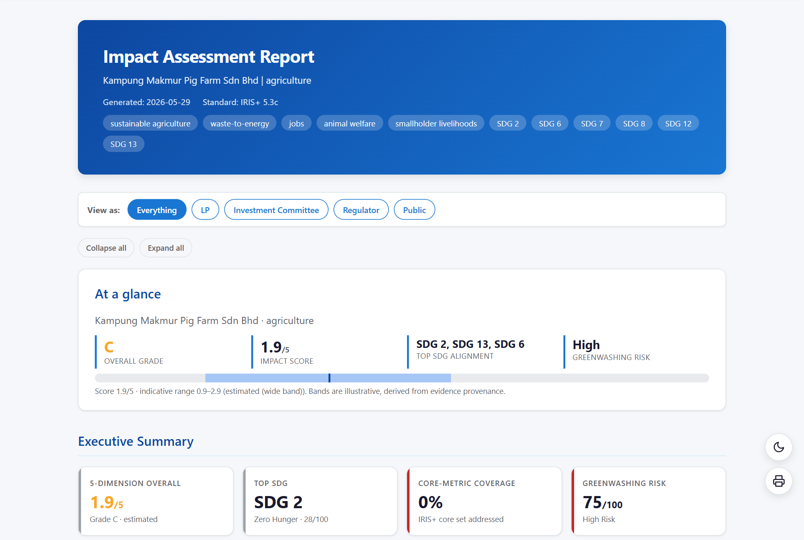
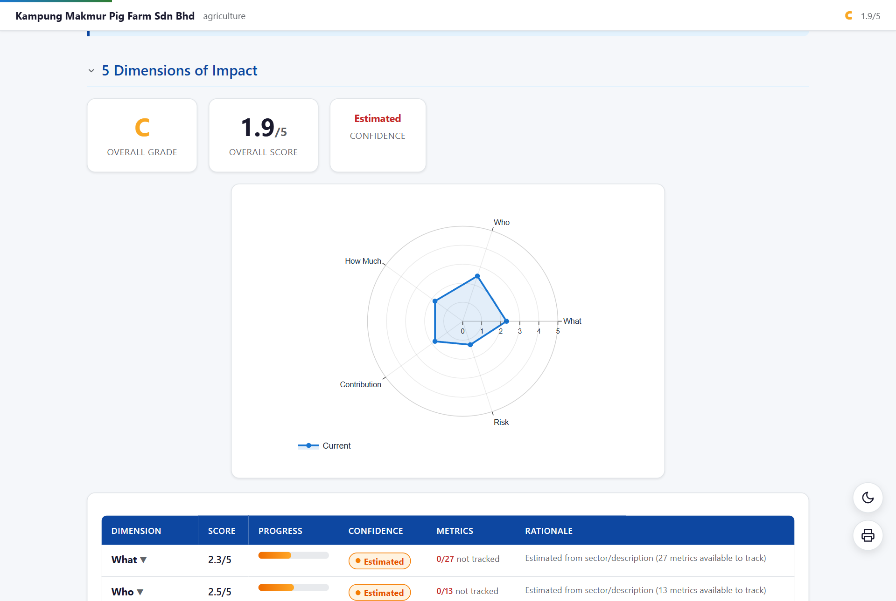
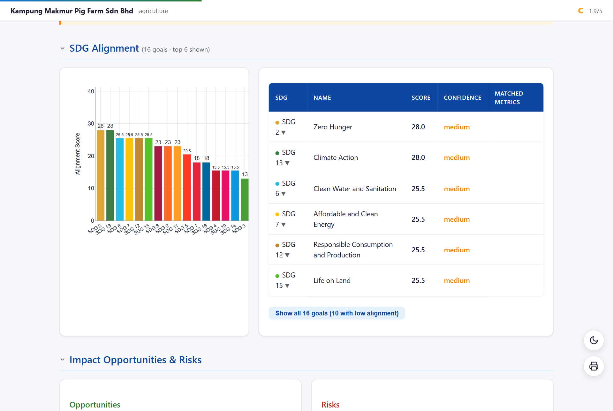
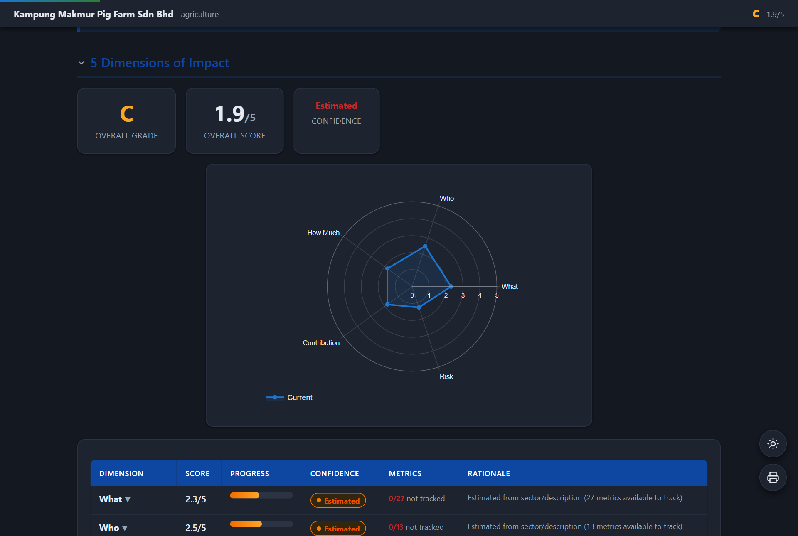
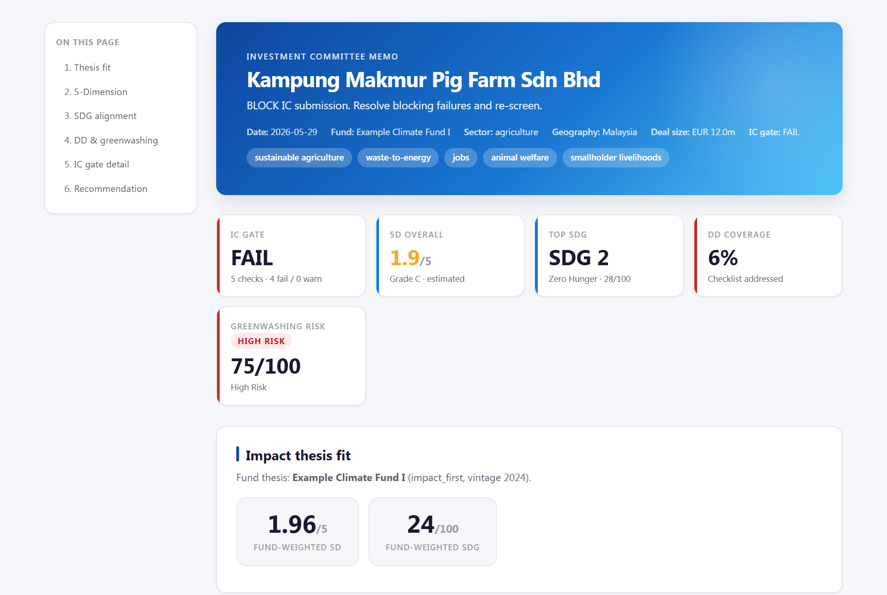
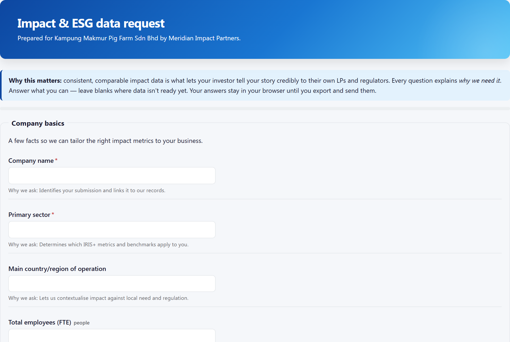
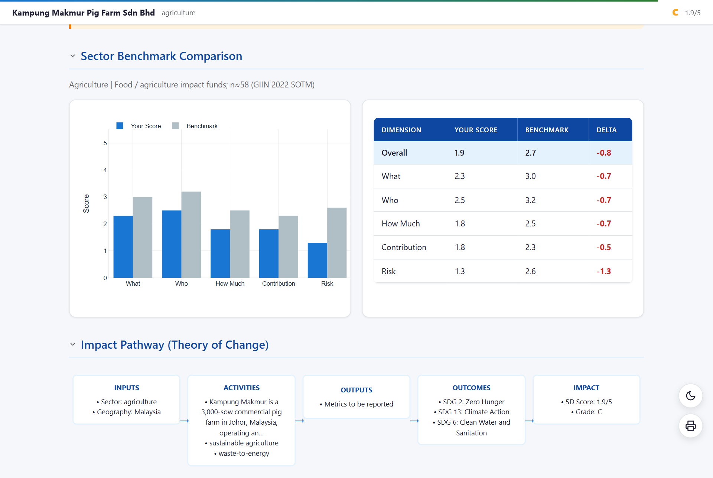
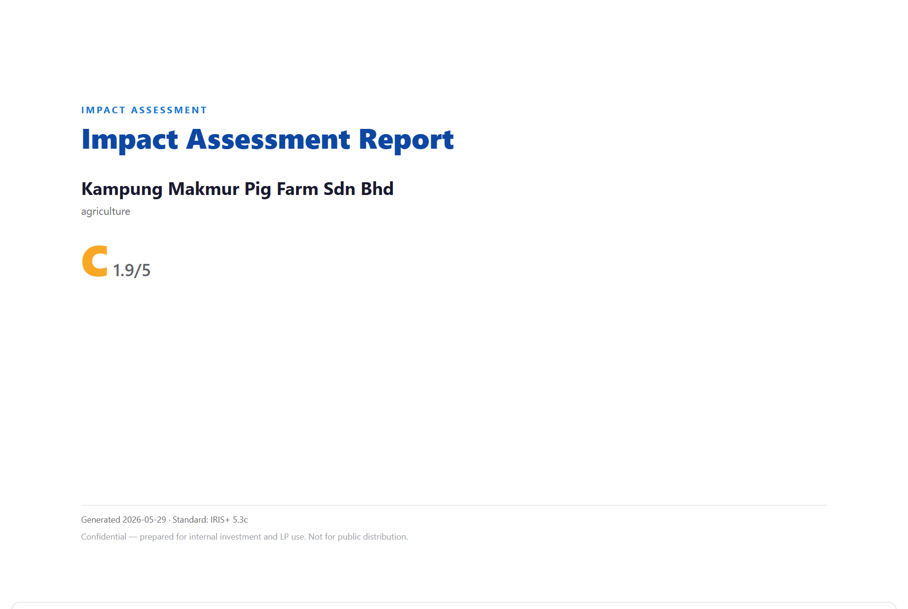

# Impact Vision — sample deliverables

Every file in this folder is **real output** from the open-source toolkit — nothing
was hand-edited. They were all generated from a single offline company profile
(a 3,000-sow pig farm in Johor, Malaysia) so you can see exactly what the agent
produces end to end.

> **Open [`index.html`](index.html)** for a browsable gallery, or open any HTML
> file below directly in your browser.

## What's in here

| File | Deliverable |
|------|-------------|
| [`01_impact_report.html`](01_impact_report.html) | Flagship **impact assessment** — executive tear sheet, 5-Dimension radar, SDG alignment, gap analysis, sector benchmark, greenwashing screen, opportunities & risks. Includes the full reading chrome (audience filter, collapsible sections, sticky mini-header, dark-mode toggle, print cover). |
| [`02_impact_report_dark.html`](02_impact_report_dark.html) | The same report rendered in the **accessible dark palette**. |
| [`03_impact_report_branded.html`](03_impact_report_branded.html) | **White-label** variant — custom primary/accent colours and a fund footer, no template fork. |
| [`04_ic_memo.html`](04_ic_memo.html) | **Investment-committee memo** — IC gate decision, thesis-fit scorecard, DD coverage and greenwashing summary. |
| [`05_dd_report.html`](05_dd_report.html) | **Due-diligence coverage report** — 122-question checklist coverage, NESTA evidence levels, severity-ranked gaps. |
| [`06_investee_portal.html`](06_investee_portal.html) | **Investee data-collection portal** — self-contained, offline, plain-language SFDR PAI, client-side validation, local JSON export (no upload). |
| `pig_farm_dd_questionnaire.docx` | The DD questionnaire as an **editable Word** document. |
| `pig_farm_profile.json` | The input profile (kept for reproducibility). |

## A few highlights

| | |
|---|---|
|  |  |
| *Executive tear sheet, audience filter ("View as…"), expand/collapse, KPI cards.* | *5-Dimension radar with per-dimension scores, confidence and provenance.* |
|  |  |
| *SDG alignment scored across all 17 goals (official UN colours).* | *The same report in the accessible dark palette.* |
|  |  |
| *IC memo: gate decision, thesis fit, DD & greenwashing scorecard.* | *Investee-facing portal with "why we ask" rationales and offline export.* |
|  |  |
| *Sector benchmark: your score vs peer median, with deltas.* | *Print / PDF cover page (shown via print-media emulation).* |

All screenshots (gallery thumbnails + feature close-ups, 17 in total) live in
[`screenshots/`](screenshots/).

## Reproduce it yourself

Everything here is **offline and deterministic** — no API key, no network needed
to generate the HTML.

```bash
# 1. Regenerate every HTML deliverable (+ profile + docx + gallery index)
python demo/generate_demo.py

# 2. (Optional) refresh the screenshots — drives the installed Edge/Chrome headlessly.
#    Charts load Plotly from a CDN, so cache it once for offline rendering:
python demo/_fetch_plotly.py      # one-time: caches plotly.min.js into demo/.cache/
python demo/_screenshot.py        # writes PNGs into demo/screenshots/

# 3. (Optional) structural QA before committing
python demo/_verify.py
```

`demo/_screenshot.py` uses [Playwright](https://playwright.dev/python/) driving the
system browser (Microsoft Edge by default), so no separate browser download is
required.

## Notes

- **Illustrative data only.** The pig-farm profile is hand-written for
  demonstration; scores, grades and risk flags are produced by the engine's
  heuristics, not a real diligence.
- The example deliberately scores **Grade C / High greenwashing risk / low DD
  coverage** — a claim-heavy founder pitch with thin verification — to show the
  toolkit doing critical analysis rather than rubber-stamping.
